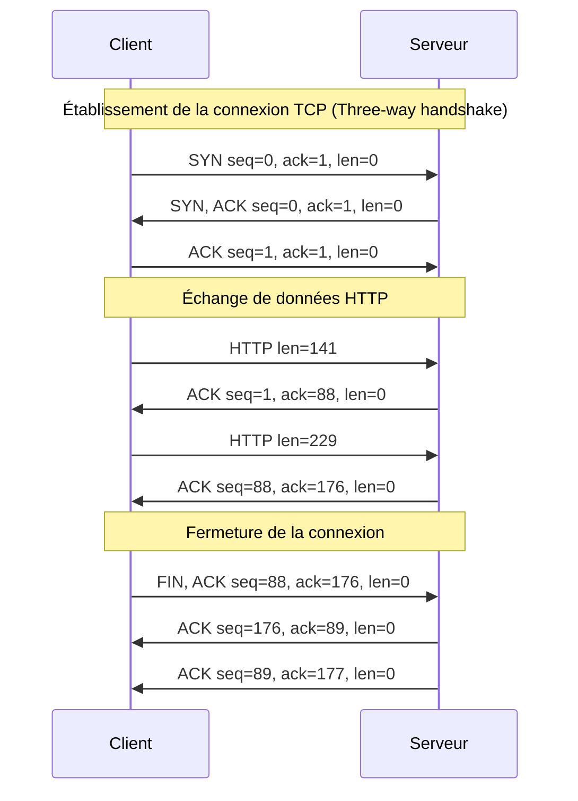

# 📘 Documentation Wireshark – Initiation aux Protocoles Réseaux et au Modèle OSI

---

## Introduction à Wireshark

**Wireshark** est un analyseur de paquets réseau libre et open source. Il permet de capturer et visualiser le trafic circulant sur une interface réseau en temps réel. Grâce à lui, on peut **analyser le contenu des paquets** (ou trames), filtrer par protocole, IP, port, etc.

Wireshark permet aussi d’examiner les différentes **couches du modèle OSI** en désencapsulant les données contenues dans chaque trame.

---

## Différence entre une trame et un paquet

* **Trame (Frame)** : unité de données au **niveau de la couche liaison (couche 2 OSI)**. Elle contient les adresses MAC source/destination, et les données utiles pour les couches supérieures.
* **Paquet (Packet)** : unité de données au **niveau de la couche réseau (couche 3 OSI)**. Il transporte des données entre adresses IP.

> En résumé : une **trame encapsule un paquet**.

---

## 3. Formats PCAP/PCAPNG

* **PCAP** : format de fichier de capture standard utilisé par Wireshark.
* **PCAPNG** (PCAP Next Generation) : version améliorée, plus flexible, supportant plusieurs interfaces, des métadonnées, des commentaires, etc.

---

### 📘 TCP

Format TCP  :

| Étape      | Drapeau TCP | Description       |
| ---------- | ----------- | ----------------- |
| 1. SYN     | SYN         | Début connexion   |
| 2. SYN-ACK | SYN, ACK    | Réponse serveur   |
| 3. ACK     | ACK         | Connexion établie |

---

## Installation Wireshark

* Tout d'abord faut crée une machine virtuelle sous **linux**.
* Ouvrez votre terminal :
    ```
    sudo apt install wireshark
    sudo apt install curl
    curl alcasar.laplateforme.io
    ```
* Puis sur les filtres de **Wireshark** faut mettre **tcp** cela va afficher **Seq=1 Ack=1** sela veut dire que la connexion a marché.

---

## Diagramme mécanisme de connexion



# Partie 2

## Création d'une deuxième VM Client

* Faut crée une deuxième VM pour le coté Client avec Wireshark :
```
    sudp apt install wireshark
```

## Installation des différents services

**1. 🟡 DHCP**
* 🔧 Installation :
`
sudo apt install isc-dhcp-client
`
* 📡 Commande pour générer du trafic :
`
sudo dhclient -r && sudo dhclient
`


**2. 🌐 DNS**
* 🔧 Installation :
`
sudp apt install curl
`
* 📡 Commande pour générer du trafic :
`
curl alcasar.laplateforme.io
`


**3. 📣 mDNS (Multicast DNS)**
* 🔧 Installation :
`
sudo apt install avahi-daemon avahi-utils
`
* 📡 Commande pour générer du trafic :
`
avahi-browse -a
`


**4. 🔐 SSL / TLSv1.2 / HTTPS**
* 🔧 Installation :
`
sudp apt install curl
`
* 📡 Commande pour générer du trafic :
`
curl alcasar.laplateforme.io
`


**5. 📁 FTP**
* 🔧 Installation :
`
sudo apt install vsftpd ftp
`

🔌 Connexion pour générer du trafic :
`
ftp <IP_DU_SERVEUR>
`


**6. 📂 SMB**
* 🔧 Installation :
`
sudo apt install samba smbclient
`

🧪 Connexion :
`
smbclient -L //<IP_SERVEUR> -U <utilisateur>
`


### **Chiffrement des données**

| Type d’échange       | Données visibles  ? | Risque de fuite des identifiants |
| -------------------- | ------------------------------ | -------------------------------- |
| FTP sans TLS         | Oui (tout en clair)            | Oui, très élevé                  |
| FTP avec TLS (FTPS)  | Non (données chiffrées)        | Non, sécurisé                    |
| SSL/TLS (ex : HTTPS) | Non (données chiffrées)        | Non, sécurisé                    |

# Partie 3 : tshark

Dans cette partie nous allons voir comment on utilise wireshark dans l'invité de commande avec `tshark`

## Installation de tshark 

Ouvrez l'invité de commande linux, et tapez :

```sudo apt install tshark -y```

## Ecouter le réseaux sur votre carte réseaux : 

` tshark -i ens33 -f "tcp port 443" -w https_traffic.pcap `

* ` tshark `= la commande qui permet de lancer wireshark en invité de commande

* ` -i ens33 `= remplacez par le nom de votre carte réseaux
* ` -f`= filtre de capture
* `"tcp port 443"`= on capture uniquement le trafic TTC sur le port 433, utilisé pour le HTTPS
* `-w`= write
* `https_trafic.pcap`= nom du fichier (que vous pouvez remplacer) dans lequel les paquetes seront enregistrer.

## Exemple de port que l'on doit utiliser pour chaque protocoles 

- **DHCP** : UDP 67 (serveur), UDP 68 (client)
- **DNS** : UDP 53 / TCP 53
- **mDNS** : UDP 5353 (Multicast DNS local)
- **FTP** : TCP 21 (commande), TCP 20 (données en mode actif)
- **SMB** : TCP 445 (partage de fichiers), anciens ports NetBIOS : 137-139
- **HTTPS** : TCP 443
- **SSL** : Pas de port dédié (utilisé avec ex : 443 pour HTTPS, 993 pour IMAPS, 995 pour POP3S)
- **TLS v1.2** : Pas de port dédié (ex : HTTPS → 443, SMTP → 587)
- **Message (mail)** :
  - SMTP : TCP 25 / 587 (TLS)
  - IMAP : TCP 143 / 993 (TLS)
  - POP3 : TCP 110 / 995 (TLS)

### En commande `tshark` cela donne : 

* **DHCP** : tshark -f "udp port 67 or udp port 68"

* **DNS** : tshark -f "port 53"

* **mDNS** (Multicast DNS local) : tshark -f "udp port 5353"

* **FTP** (commande et données actives) : tshark -f "tcp port 20 or tcp port 21"

* **SMB** (partage de fichiers Windows) : tshark -f "tcp port 445"

* **HTTPS** (HTTP sécurisé via TLS) : tshark -f "tcp port 443"

* **SSL / TLS** (inclut TLS v1.2 et connexions chiffrées mail) : tshark -f "tcp port 443 or tcp port 993 or tcp port 995 or tcp port 587"

* **SMTP** (mail sortant) : tshark -f "tcp port 25 or tcp port 587"

* **IMAP** (mail entrant moderne) : tshark -f "tcp port 143 or tcp port 993"

* **POP3** (ancien protocole de mail entrant) : tshark -f "tcp port 110 or tcp port 995"

* **Tous les messages mail** (SMTP, IMAP, POP3) : tshark -f "tcp port 25 or tcp port 587 or tcp port 143 or tcp port 993 or tcp port 110 or tcp port 995"